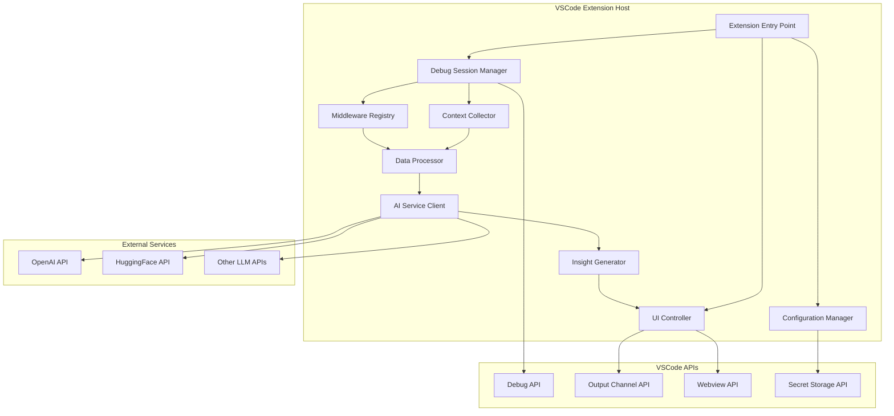

# Design Document

## Overview

The AI-powered invisible debugging extension is architected as a VSCode extension that leverages the Debug Adapter Protocol (DAP) and VSCode Extension API to transparently collect runtime debugging context. The system uses a modular architecture with clear separation between data collection, processing, AI integration, and user interface components.

## Architecture



## Components and Interfaces

### Debug Session Manager
**Purpose:** Orchestrates debug session lifecycle and event handling

**Key Responsibilities:**
- Hook into VSCode Debug API events (start, stop, breakpoint, exception)
- Manage session state and correlation IDs
- Coordinate between context collection and middleware systems

**Interface:**
```typescript
interface IDebugSessionManager {
  startSession(session: vscode.DebugSession): void;
  stopSession(session: vscode.DebugSession): void;
  onBreakpoint(event: DebugBreakpointEvent): void;
  onException(event: DebugExceptionEvent): void;
  onStepComplete(event: DebugStepEvent): void;
}
```

### Context Collector
**Purpose:** Captures and structures runtime debugging information

**Key Responsibilities:**
- Extract variable states, stack traces, and source references
- Capture console outputs and error messages
- Maintain context correlation across debug events
- Apply data redaction and filtering rules

**Interface:**
```typescript
interface IContextCollector {
  collectVariables(frame: DebugStackFrame): VariableSnapshot[];
  collectStackTrace(thread: DebugThread): StackTraceData;
  collectConsoleOutput(output: ConsoleMessage): LogEntry;
  collectException(exception: ExceptionInfo): ExceptionData;
}
```

### Middleware Registry
**Purpose:** Manages framework-specific instrumentation and data collection

**Key Responsibilities:**
- Register and manage middleware for different frameworks (Axios, Fetch, etc.)
- Provide extension points for custom instrumentation
- Handle network request/response interception

**Interface:**
```typescript
interface IMiddlewareRegistry {
  registerMiddleware(name: string, middleware: IMiddleware): void;
  unregisterMiddleware(name: string): void;
  instrumentFramework(framework: string): void;
  collectNetworkData(request: NetworkRequest, response: NetworkResponse): NetworkData;
}
```

### Data Processor
**Purpose:** Processes, filters, and structures collected data for AI consumption

**Key Responsibilities:**
- Aggregate context from multiple sources
- Apply privacy filters and data redaction
- Structure data into AI-friendly JSON format
- Manage data retention and cleanup

**Interface:**
```typescript
interface IDataProcessor {
  processContext(rawContext: RawDebugContext): ProcessedContext;
  applyPrivacyFilters(context: ProcessedContext): FilteredContext;
  structureForAI(context: FilteredContext): AIReadyContext;
  cleanupOldData(retentionPolicy: RetentionPolicy): void;
}
```

### AI Service Client
**Purpose:** Manages communication with various LLM providers

**Key Responsibilities:**
- Handle multiple AI provider integrations (OpenAI, HuggingFace, etc.)
- Manage API authentication and rate limiting
- Format requests and parse responses
- Provide fallback mechanisms

**Interface:**
```typescript
interface IAIServiceClient {
  sendDiagnosticRequest(context: AIReadyContext, provider: AIProvider): Promise<DiagnosticResponse>;
  configureProvider(provider: AIProvider, config: ProviderConfig): void;
  testConnection(provider: AIProvider): Promise<boolean>;
}
```

### UI Controller
**Purpose:** Manages user interface components and interactions

**Key Responsibilities:**
- Control side panel webview for AI insights
- Manage status bar indicators and notifications
- Handle user configuration and settings
- Provide toggle controls for AI debug mode

**Interface:**
```typescript
interface IUIController {
  showInsights(insights: DiagnosticInsights): void;
  updateStatus(status: ExtensionStatus): void;
  showConfiguration(): void;
  toggleAIMode(enabled: boolean): void;
}
```

## Data Models

### Debug Context Structure
```typescript
interface DebugContext {
  sessionId: string;
  timestamp: number;
  eventType: 'breakpoint' | 'exception' | 'step' | 'console';
  sourceLocation: {
    file: string;
    line: number;
    column: number;
  };
  stackTrace: StackFrame[];
  variables: VariableSnapshot[];
  consoleOutput: LogEntry[];
  networkActivity: NetworkData[];
  exception?: ExceptionInfo;
}

interface StackFrame {
  name: string;
  file: string;
  line: number;
  column: number;
  scope: string;
}

interface VariableSnapshot {
  name: string;
  value: any;
  type: string;
  scope: 'local' | 'global' | 'closure';
  isRedacted: boolean;
}

interface NetworkData {
  method: string;
  url: string;
  headers: Record<string, string>;
  requestBody?: any;
  responseStatus: number;
  responseBody?: any;
  duration: number;
  timestamp: number;
}
```

### AI Integration Models
```typescript
interface AIReadyContext {
  summary: string;
  errorDescription?: string;
  codeContext: {
    language: string;
    framework?: string;
    relevantCode: string[];
  };
  runtimeState: {
    variables: VariableSnapshot[];
    stackTrace: StackFrame[];
    networkActivity: NetworkData[];
  };
  userQuery?: string;
}

interface DiagnosticResponse {
  analysis: string;
  suggestedFixes: string[];
  confidence: number;
  relatedDocumentation: string[];
  followUpQuestions: string[];
}
```

## Error Handling

### Collection Errors
- **Strategy:** Graceful degradation with partial context collection
- **Implementation:** Try-catch blocks around each collection method with fallback to basic error info
- **User Impact:** Continue debugging session with reduced AI context rather than failure

### AI Service Errors
- **Strategy:** Multiple provider fallback with offline mode
- **Implementation:** Provider priority queue with automatic failover
- **User Impact:** Attempt alternative AI services or provide manual analysis options

### Performance Issues
- **Strategy:** Adaptive collection with performance monitoring
- **Implementation:** Monitor collection overhead and reduce detail level if performance degrades
- **User Impact:** Maintain responsive debugging with potentially less detailed AI context

### Privacy Violations
- **Strategy:** Fail-safe data redaction with user override
- **Implementation:** Conservative redaction rules with user-configurable sensitivity levels
- **User Impact:** Protect sensitive data by default with option to include more context

## Testing Strategy

### Unit Testing
- **Scope:** Individual component functionality and interfaces
- **Tools:** Jest/Mocha for TypeScript components
- **Coverage:** All data collection, processing, and AI integration logic
- **Mocking:** VSCode APIs, AI service responses, debug session events

### Integration Testing
- **Scope:** Component interaction and data flow
- **Tools:** VSCode Extension Test Runner
- **Coverage:** Debug session lifecycle, middleware registration, UI updates
- **Environment:** Simulated debug sessions with controlled test applications

### End-to-End Testing
- **Scope:** Complete user workflows and AI integration
- **Tools:** VSCode Extension Test Suite with real debug scenarios
- **Coverage:** Full debugging sessions with AI analysis and insight generation
- **Validation:** Verify context accuracy, AI response quality, and performance impact

### Performance Testing
- **Scope:** Extension overhead and responsiveness
- **Metrics:** Memory usage, CPU impact, debug session latency
- **Benchmarks:** < 5% performance overhead, < 100ms context collection latency
- **Tools:** VSCode performance profiler and custom metrics collection

### Security Testing
- **Scope:** Data redaction, API key security, network communication
- **Validation:** PII detection accuracy, secure storage verification, encrypted transmission
- **Compliance:** GDPR considerations for data handling and user consent